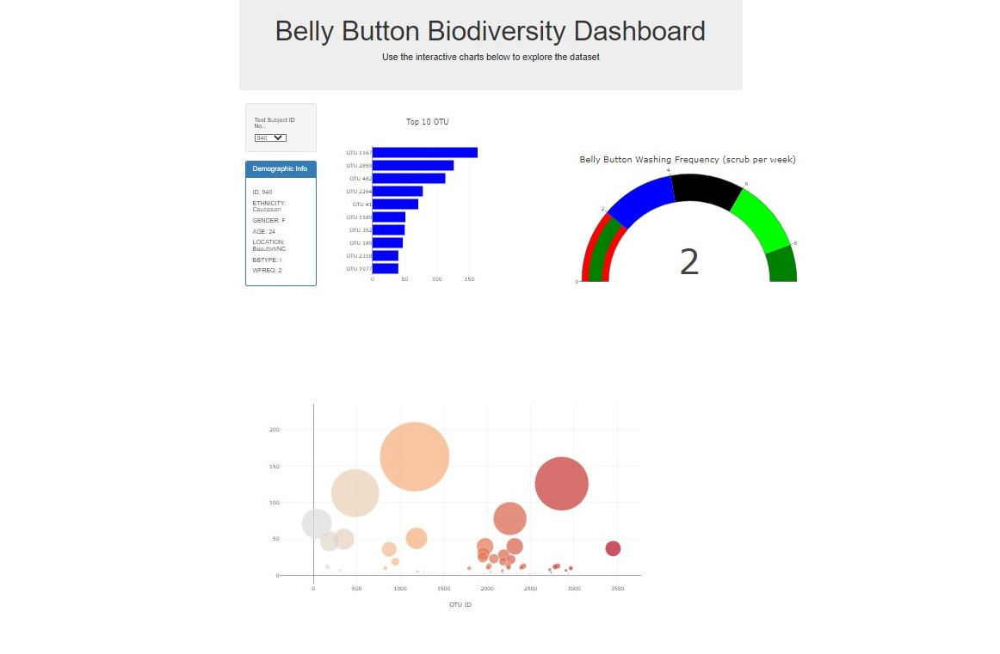

# Unit 14 Homework: Belly Button Biodiversity

In this assignment, an interactive dashboard was built to explore the [Belly Button Biodiversity dataset](http://robdunnlab.com/projects/belly-button-biodiversity/), which catalogs the microbes that colonize human navels.

The dataset reveals that a small handful of microbial species (also called operational taxonomic units, or OTUs, in the study) were present in more than 70% of people, while the rest were relatively rare.

## Instructions

Complete the following steps:

1. Use the D3 library to read in `samples.json` 

2. Create a horizontal bar chart with a dropdown menu to display the top 10 OTUs found in that individual.

  * Use `sample_values` as the values for the bar chart.

  * Use `otu_ids` as the labels for the bar chart.

  * Use `otu_labels` as the hovertext for the chart.

  

3. Create a bubble chart that displays each sample.

  * Use `otu_ids` for the x values.

  * Use `sample_values` for the y values.

  * Use `sample_values` for the marker size.

  * Use `otu_ids` for the marker colors.

  * Use `otu_labels` for the text values.

